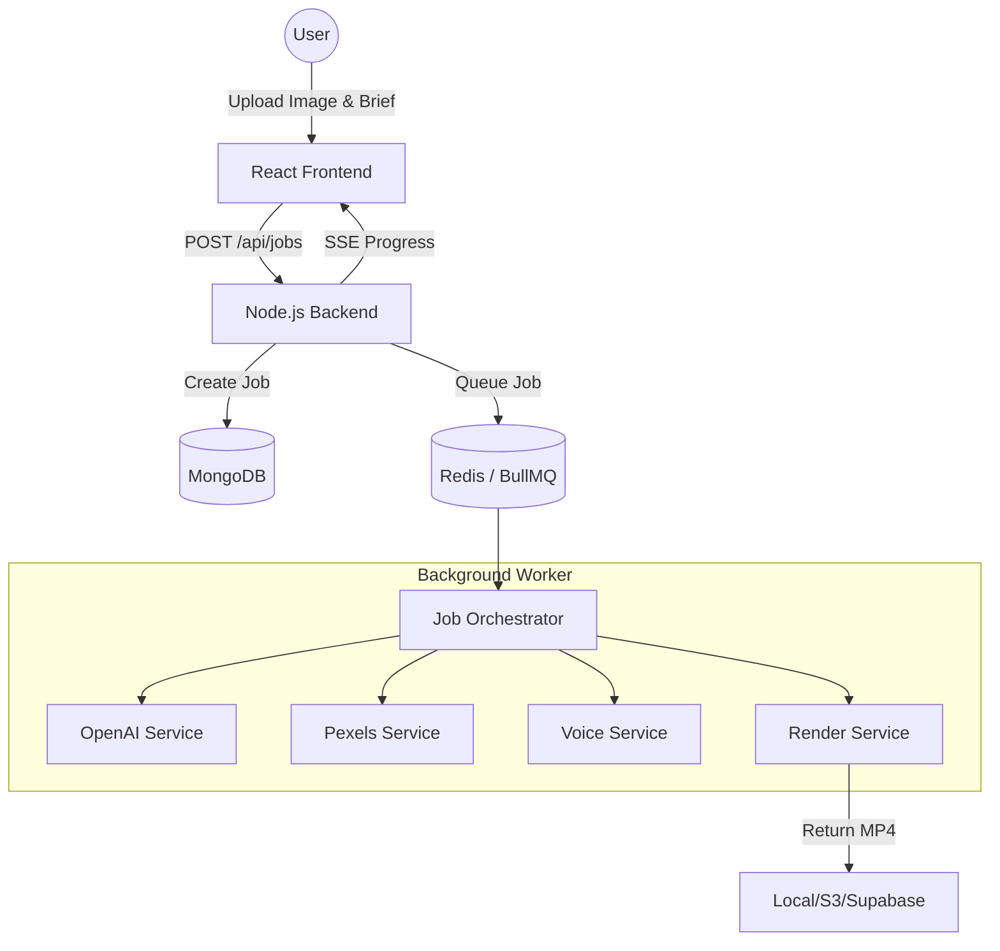

# AI Marketing Studio Documentation

Welcome to the official documentation for the **AI Marketing Studio**. This project is a full-stack application designed to automate the creation of high-quality, short-form marketing videos (TikTok/Reels/Shorts) using AI.

## 🚀 Project Overview

The AI Marketing Studio takes a product image and a description, then automatically:
1.  **Generates a Script**: Using OpenAI, it creates a scene-by-scene script with hooks and CTAs.
2.  **Finds Media**: Searches Pexels for relevant background videos.
3.  **Generates Voiceover**: Uses Deepgram or ElevenLabs for high-quality TTS.
4.  **Renders Video**: Uses FFmpeg to composite everything into a vertical 1080x1920 MP4.

---

## 🏗 System Architecture



---

## 🛠 Tech Stack

### Frontend
- **Framework**: React 18 with Vite
- **Styling**: TailwindCSS
- **Animations**: Framer Motion
- **Communication**: Axios + Server-Sent Events (SSE) for real-time progress.

### Backend
- **Runtime**: Node.js (TypeScript)
- **Framework**: Express
- **Database**: MongoDB (Mongoose)
- **Task Queue**: BullMQ with Redis
- **Processing**: FFmpeg (via `fluent-ffmpeg`)

### AI & External Services
- **LLM**: OpenAI (GPT-4o/GPT-3.5) for script writing and keyword extraction.
- **Media**: Pexels API for stock footage.
- **Voice**: Deepgram (default) or ElevenLabs for TTS.
- **Storage**: Local filesystem, AWS S3, or Supabase Storage.

---

## 📂 Core Backend Services

### `JobOrchestrator`
The "brain" of the backend. It coordinates the sequence of events:
- Validates inputs.
- Triggers script generation.
- Parallelizes media search and voice generation.
- Handles retries and error reporting.

### `OpenAiService`
Handles all LLM interactions. It uses structured prompting to ensure the generated scripts follow marketing best practices (Hook -> Value -> CTA).

### `PexelsService`
Takes keywords generated by AI and finds high-quality portrait videos. It includes fallback logic to image generation if no videos are found.

### `VoiceService`
Generates audio files from the script. It also extracts timing metadata (word-level timestamps) to ensure captions are perfectly synced in the final video.

### `RenderService`
The most complex part of the system. It uses FFmpeg to:
- Resize and crop assets to 1080x1920.
- Overlay text captions with custom fonts and animations.
- Mix voiceover with background music (auto-ducking).
- Concatenate scenes into a final MP4.

---

## 📱 Frontend Structure

The frontend is a single-page studio application.

- **`App.tsx`**: The main entry point containing the landing page, upload logic, and the generation workspace.
- **`components/`**:
    - `VideoPreview`: Real-time preview of the generation progress.
    - `StatusTimeline`: Shows which stage the AI is currently in (Scripting, Searching, Rendering).
- **`hooks/`**:
    - `useJobEvents.ts`: Manages the SSE connection to the backend to receive live updates.

---

## ⚙️ Environment Configuration

Both frontend and backend require `.env` files. Key variables include:

| Variable | Description |
| :--- | :--- |
| `OPENAI_API_KEY` | Required for script generation. |
| `PEXELS_API_KEY` | Required for video assets. |
| `DEEPGRAM_API_KEY` | Required for voiceover. |
| `MONGODB_URI` | Connection string for the database. |
| `REDIS_URL` | Connection string for BullMQ. |

---

## 📝 API Endpoints

### Jobs
- `POST /api/jobs`: Start a new video generation job.
- `GET /api/jobs/:id`: Get the status of a specific job.
- `GET /api/jobs/:id/stream`: Subscribe to SSE updates for a job.

### Assets
- `GET /api/assets/:id`: Retrieve rendered videos or uploaded images.

---

## 🛠 Development Setup

1.  **Clone the repo**:
    ```bash
    git clone <repo-url>
    ```
2.  **Run the setup script**:
    ```bash
    chmod +x setup.sh
    ./setup.sh
    ```
3.  **Start Services**:
    ```bash
    docker-compose up -d
    npm run dev
    ```

---

## 🎯 Best Practices for Prompting

When using the studio, keep descriptions focused on the **transformation**.
*   *Bad*: "A red bottle of shampoo."
*   *Good*: "Sulfate-free red shampoo that fixes frizzy hair in one wash. Perfect for busy mornings."

The AI performs better when it understands the *benefit* of the product.
